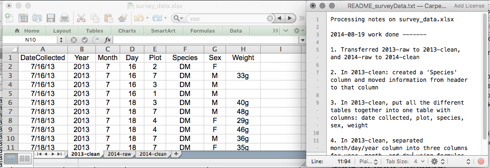
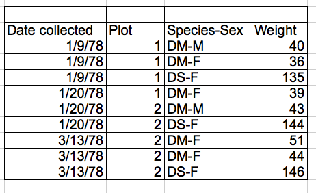

<div class = "blue">
### Learning objectives

* Understand how to format raw data to be "tidy"
* Know common data formatting/data entry mistakes to avoid
* Introduction to dates as data
* Know how to load a package
* Be able to describe what data frames and tibbles are
* Know how to use `read.csv()` to read a CSV file into R
* Be able to explore a data frame
* Be able to use subset a data frame
* Know the distinctions base R and `tidyverse`

</div>
<br>

## Videos

- Accessing spreadsheets (coming soon)
- Data Import (coming soon)
- [Video Discussion](https://canvas.ucdavis.edu/courses/1019595/assignments/1510678)

## In Class Coding

[Submit Week 3 In Class Coding](https://canvas.ucdavis.edu/courses/1019595/assignments/1509409)

<br>

```{r, echo=FALSE}
knitr::opts_chunk$set(rows.print=10, R.options=list(max.print=50))
```

# Part 1: Best Practices for Spreadsheets

This lesson is adapted from [Data Carpentry's Data Organization in Spreadsheets for Ecologists](https://datacarpentry.org/spreadsheet-ecology-lesson/).

## Formatting
- Never modify your raw data. Always make a copy before making any changes.  
- Keep track of all of the steps you take to clean your data in a plain text file.
  


- Organize your data according to [tidy data principles](https://www.jstatsoft.org/article/view/v059i10).
  - Each column is a variable like "weight" or "site_ID"
  - Each row is a single observation
  - Don't combine pieces of information in a single cell
  
This is bad:



Why? Species and sex should be split into separate columns.

## Avoiding Common Mistakes
- Avoid using multiple tables within one spreadsheet.
- Avoid spreading data across multiple tabs.
  - Programs other than Excel will have a tough time seeing tabs
  - Instead of adding a new tab, keep adding rows, and maybe use a new column for the info you'd be splitting across tabs. For example, use a column for Year instead of a new tab for a new year.
  - If your table gets big, [freeze your column headers](https://support.office.com/en-ca/article/Freeze-column-headings-for-easy-scrolling-57ccce0c-cf85-4725-9579-c5d13106ca6a) to make them easier to see while you scroll.
- Record zeros as zeros.
  - Zeros are data! Don't use blanks, and don't use zeros as null values
- Use an appropriate null value to record missing data.
  - There's a broader discussion of this in [White et al 2013](https://peerj.com/preprints/7/), but here's a quick look at their recommendations:
  
  


- Don't use formatting to convey information or to make your spreadsheet look pretty.
  - R won't see cell colors or bold fonts
  - Keep data as characters or numbers 
- Place comments in a separate column.
  - Don't use Excel's "comments" functionality, other programs don't recognize these
  - Just use a separate text column
- Record units in column headers.
  - Don't put units in your data cells!
  - 10cm will be read as characters, not numbers
- Include only one piece of information in a cell.
- Avoid spaces, numbers and special characters in column headers.
<table align = "center" style = "width =80%; border: 1px solid black;">
<tr>
	<td> <b>Good Name</b></td> <br />
	<td> <b>Good Alternative </b> </td><br />
	<td> <b>Avoid </b></td><br />
</tr>
<tr>
	<td> Max_temp_C</td>
	<td> MaxTemp </td>
	<td> Maximum Temp (°C) </td>
</tr>
<tr>
	<td> Precipitation_mm</td>
	<td> Precipitation</td>
	<td> precmm </td>
</tr>	
<tr>
	<td> Mean_year_growth</td>
	<td> MeanYearGrowth </td>
	<td> Mean growth/year</td>	
</tr>	
<tr>
	<td> sex </td>
	<td> sex </td>	
	<td> M/F </td>
</tr>
<tr>	
	<td> weight </td>
	<td> weight </td>	
	<td> w.</td>	
</tr>
<tr>	
	<td> cell_type </td>
	<td> CellType </td>
	<td> Cell Type </td>
</tr>
<tr>
	<td> Observation_01 </td>
	<td> first_observation</td>
	<td> 1st Obs</td>
</tr>
</table>

<br/><br/>

- Avoid special characters in your data.
  - Copy-pasting text into cells (ex. from Word) can do weird stuff
- Record metadata in a separate plain text file.
  - When in doubt, use a README
  - Put metadata in same directory as the data file itself, with an appropriate name

## Dates as Data
- Excel was apparently created by people who hate time
- Excel stores dates in several different ways
  - For Windows, it stores dates as **number of days since Jan 1 1900**
  - For Mac, it stores dates as **number of days since Jan 1 1904**
    - Check for dates that are ~4 years off
  - Excel's base is to store dates as numbers, but it dresses them up in different ways, like 9/1/2018 or Sept-1-2018
- Excel will often take one entry (Jul-10 for the 10th of July) and interpret it as another (1-July-2010)
  - It will even coerce data that aren't dates into dates
  - You have to be very careful, because Excel won't tell you when it does things like this
- Treating dates as multiple pieces of data rather than one makes them easier to handle.
  - Use separate columns for year, month, and day
  - You can also use columns for year and day-of-year (1 to 365)
- Ultimately, avoid letting Excel handle dates, it's hard to know what it will do

## Quality Control
- Always copy your original spreadsheet file and work with a copy so you don't affect the raw data.
  - It can be helpful to have separate "Raw" and "Clean" data folders
- Use data validation to prevent accidentally entering invalid data--this can be especially useful if you have others entering data for you. 
  1. Select the cells or column you want to validate
  2. On the `Data` tab select `Data Validation`
  3. In the `Allow` box select the kind of data that should be in the
   column. Options include whole numbers, decimals, lists of items, dates, and
   other values.
  4. You can then give a range of values or enter a comma-separated list of allowable values in the `Source` box
  5. You can use the `Input Message` tab to customize the error message given when an incorrect value is entered
    - "Sorry faithful undergraduate field assistant, we only have plots 1-10"
    - You can make incorrect values throw warnings instead of errors using the `Style` option on the `Error Alert` tab
- Use sorting to check for invalid data.
- Use conditional formatting (cautiously) to check for invalid data.
  - Conditional formatting can color cells based on their value
  - You can then visually scan for strange values
  - Can be useful, but definitely not foolproof

## Exporting Data
- Data stored in common spreadsheet formats will often not be read correctly into data analysis software, introducing errors into your data.
  - try not to use .xls or .xlxs or .xxlsxlsxlllslxlsllaslxl or whatever
- Exporting data from spreadsheets to formats like CSV or TSV puts it in a format that can be used consistently by most programs.
  - Not only will this be easier for R to read, but it is widely recognized and will likely be around for a long time
  - CSV and TSV are, ultimately, plain-text files, which are simple and classy and timeless

# Part 2: Starting with Spreadsheets in R

Now that we've learned a bit about how R is thinking about data under the hood, using different types of vectors to build more complicated data structures, let's actually look at some data.

## Presentation of the Survey Data

```{r, echo=FALSE, purl=TRUE}
### Presentation of the survey data
```

We are studying the species repartition and weight of animals caught in plots in our study
area. The dataset is stored as a comma separated value (CSV) file.
Each row holds information for a single animal, and the columns represent:

| Column           | Description                        |
|------------------|------------------------------------|
| record\_id       | Unique id for the observation      |
| month            | month of observation               |
| day              | day of observation                 |
| year             | year of observation                |
| plot\_id         | ID of a particular plot            |
| species\_id      | 2-letter code                      |
| sex              | sex of animal ("M", "F")           |
| hindfoot\_length | length of the hindfoot in mm       |
| weight           | weight of the animal in grams      |
| genus            | genus of animal                    |
| species          | species of animal                  |
| taxon            | e.g. Rodent, Reptile, Bird, Rabbit |
| plot\_type       | type of plot                       |

## Loading the Data

Your current R project should already have a `data` folder with the surveys data CSV file in it. We can read it into R and assign it to an object by using the `read.csv()` function. The first argument to `read.csv()` is the path of the file you want to read, in quotes. This path will be relative to your current **working directory**, which in our case is the R Project folder. So from there, we want to access the "data" folder, and then the name of the CSV file. `read.csv()` also works with urls (if you have an internet connection, of course). The url below links to a csv stored on the course github page. You can call `read.csv()` directly on the url: 

```{r, eval=TRUE,  purl=FALSE}
surveys_url <- 'https://raw.githubusercontent.com/ucd-rdavis/R-DAVIS/refs/heads/main/data/surveys.csv'
surveys <- read.csv(surveys_url)
```

or you can download the file and then load from your local computer. Note that the `destfile` is a relative location, it assumes there is a subdirectry called `data` in your working directory, and then saves a file called `portal_data_joined.csv` in that subdirectory.
```{r, eval=TRUE,  purl=FALSE}
download.file(url = surveys_url,destfile = 'data/portal_data_joined.csv')
surveys <- read.csv('data/portal_data_joined.csv')
```

* Hint: tab-completion works with file paths too. Type the pair of quotes, and with your cursor between them, hit tab to bring up the files in your working directory.

Take a look at your Environment pane and you should see an object called "surveys". We can print out the object to take a look at it by just running the name of the object. We can also check to see what class it is.

```{r}
surveys
class(surveys)
```

Wow, printing a data frame gives us quite a bit of output. This is a lot more data than the small vectors we worked with last lesson, but the basic principles remain the same.

Data frames are really just a collection of vectors: every column is a vector with a single data type, and every column is the exact same length. You can make a data frame "by hand", but they're usually created when you import some sort of tabular data into R using a function like `read.csv()`.

[](img/data-frame.svg)

## Inspecting `data.frame` Objects

When working with a large data frame, it's usually impractical to try to look at it all at once, so we'll need to arm ourselves with a series of tools for inspecting them. Here is a non-exhaustive list of some common functions to do this:

* Size:
    * `nrow(surveys)` - returns the number of rows
    * `ncol(surveys)` - returns the number of columns

* Content:
    * `head(surveys)` - shows the first 6 rows
    * `tail(surveys)` - shows the last 6 rows
    * `View(surveys)` - opens a new tab in RStudio that shows the entire data frame. Useful at times, but you shouldn't become overly reliant on checking data frames by eye, it's easy to make mistakes

* Names:
    * `colnames(surveys)` - returns the column names
    * `rownames(surveys)` - returns the row names

* Summary:
    * `str(surveys)` - structure of the object and information about the class, length and
	   content of  each column
    * `summary(surveys)` - summary statistics for each column

Note: most of these functions are "generic", they can be used on other types of
objects besides `data.frame`.

<div class = "blue">
### Challenge

Based on the output of `str(surveys)`, can you answer the following questions?    

* What is the class of the object `surveys`?   
* How many rows and how many columns are in this object?   
* How are our character data represented in this data frame?   
* How many species have been recorded during these surveys? (This may take more than just the `str()` function. Try Googling around how to count the unique observations in a character string in R)   

<details>
<summary>ANSWER</summary>
```{r, results="markup", purl=FALSE}
str(surveys)
## * class: data frame
## * how many rows: 34786,  how many columns: 13
## * the character data are characters if you have R Version 4.0.0 of later, factors for older versions
length(unique(surveys$species))
table(surveys$species)
## * how many species: 48
```
</details>
</div>
<br>

## Indexing and subsetting data frames

```{r, echo=FALSE, purl=TRUE}

## Indexing and subsetting data frames
```

When we wanted to extract particular values from a vector, we used square brackets and put index values in them. Since data frames are made out of vectors, we can use the square brackets again, but with one change. Data frames are 2-dimensional, so we need to specify **row** and **column** indices. Row numbers come first, then a comma, then column numbers. Leaving the row number blank will return **all** rows, and the same thing applies to column numbers.

One thing to note is that the different ways you write out these indices can give you back either a data frame or a vector.

```{r, purl=FALSE}
# first element in the first column of the data frame (as a vector)
surveys[1, 1]   
# first element in the 6th column (as a vector)
surveys[1, 6]   
# first column of the data frame (as a vector)
surveys[, 1]    
# first column of the data frame (as a data.frame)
surveys[1]      
# first three elements in the 7th column (as a vector)
surveys[1:3, 7] 
# the 3rd row of the data frame (as a data.frame)
surveys[3, ]    
# equivalent to head_surveys <- head(surveys)
head_surveys <- surveys[1:6, ] 
```

`:` is a special function that creates numeric vectors of integers in increasing
or decreasing order; try running `1:10` and `10:1` to check this out.

You can also exclude certain indices of a data frame using the "`-`" sign:

```{r, purl=FALSE}
surveys[, -1]          # The whole data frame, except the first column
surveys[-c(7:34786), ] # Equivalent to head(surveys)
```

Data frames can be subset by calling indices (as shown previously), but also by calling their column names directly:

```{r, eval = FALSE, purl=FALSE}
surveys["species_id"]       # Result is a data.frame
surveys[, "species_id"]     # Result is a vector
surveys[["species_id"]]     # Result is a vector
surveys$species_id          # Result is a vector
```

In general, when you're working with data frames, you should make sure you know whether your code returns a data frame or a vector, as we see that different methods yield different results. Sometimes you get a data frame with one column, sometimes you get one vector.

You will probably end up using the `$` subsetting quite a bit. What's nice about it is that it supports tab-completion! Type out your data frame name, then a dollar sign, then hit tab to get a list of the column names that you can scroll through.

<div class = "blue">
### Challenge
We are going to create a few new data frames using our subsetting skills.

1. Create a new data frame called `surveys_200` containing row 200 of the `surveys` dataset.
2. Create a new data frame called `surveys_last`, which extracts only the last row in of `surveys`.
     * Hint: Remember that `nrow()` gives you the number of rows in a data frame
     * Compare your `surveys_last` data frame with what you see as the last row using `tail()` with the `surveys` data frame to make sure it's meeting expectations.
3. Use `nrow()` to identify the row that is in the middle of `surveys`. Subset this row and store it in a new data frame called `surveys_middle`.
4. Reproduce the output of the `head()` function by using the `-` notation (e.g. removal) and the `nrow()` function, keeping just the first through 6th rows of the `surveys` dataset.

<details>
<summary>ANSWER</summary>
```{r, purl=F}
## 1.
surveys_200 <- surveys[200, ]
## 2.
# Saving `n_rows` to improve readability and reduce duplication
n_rows <- nrow(surveys)
surveys_last <- surveys[n_rows, ]
## 3.
surveys_middle <- surveys[n_rows / 2, ]
## 4.
surveys_head <- surveys[-(7:n_rows), ]
```
</details>
</div>
<br>

## Base R vs. `tidyverse`

Almost every time you work in R, you will be using different "packages" to work with data. A package is a collection of functions used for some common purpose; there are packages for manipulating data, plotting, interfacing with other programs, and much much more.

All of the stuff we've covered so far has been using R's "base" functionality, the built in functions and techniques that come with R by default. There is a new-ish set of packages called the `tidyverse` which does a lot of the same stuff as base R, plus much much more. The `tidyverse` is what we will focus on primarily from here on out, as it is a very powerful set of tools with a philosophy that focuses on being readable and intuitive when working with data. There are a few reasons we've taught you a bunch of base R stuff so far:

1. Base R can be quick and useful in a lot of ways
1. The `tidyverse` still works with the same building blocks as base R: vectors!
1. Some packages you need to use will only work with base R
1. You will someday use Google and find a perfect solution to your problem, using base R
1. You will probably have a collaborator at some point who uses base R
1. The `tidyverse` is constantly evolving, which can be good (new features!) and bad (really old `tidyverse` code may behave differently when you update)

For example, using `[]` to subset data and using `read.csv()` are base R ways of doing things, but we'll show you `tidyverse` ways of doing them as well.

In R, there are almost always several ways of accomplishing the same task. Showing you every single way of getting a job done seems like a waste of time, but we also don't want you to feel lost when you come across some base R code, so that's why there might be a bit of redundancy.

## Loading Packages

Almost every time you work in R, you will be using different "packages" to work with data. A package is a collection of functions used for some common purpose; there are packages for manipulating data, plotting, interfacing with other programs, and much much more.

For much of this course, we'll be working with a series of packages collectively referred to as the `tidyverse`. They are packages designed to help you work with data, from cleaning and manipulation to plotting. They are all designed to work together nicely, and share a lot of similar principles. They are increasingly popular, have large user bases, and are generally very well-documented. You can install the core set of `tidyverse` packages with the `install.packages()` function:

```{r, eval=F}
install.packages("tidyverse")
```

It is usually recommended that you do **NOT** write this code into a script, or the package will be reinstalled every time you run the script. Instead, just run it once in your console, and it will be permanently installed so you can use it any time.

Once a package has been installed on your computer, you can load it in order to use it:

```{r}
library(tidyverse)
```

Loading the `tidyverse` package actually loads a whole bunch of commonly used tidyverse packages at once, which is pretty convenient.

A common feature of `tidyverse` functions is that they use underscores in the name. For example, the `tidyverse` function for reading a CSV file is `read_csv()` instead of `read.csv()`. Let's try it:

```{r}
t_surveys <- read_csv("data/portal_data_joined.csv")
```

Now let's take a look at how  prints and check the class:

```{r}
t_surveys
class(t_surveys)
```

Ooh, doesn't that print out nicely? It only prints 10 rows by default, NAs are now colored red, and under the name of each column is the type of data! One important thing to notice is that the column types are only `double` and `character`, no factors here. By default, `read_csv()` keeps character data as `character` columns, which would be like setting `stringsAsFactors=FALSE` in `read.csv()`.

Also, `class()` returned multiple things! You'll notice one of them is `data.frame`, but there are things like `tbl_df` as well. The `tidyverse` has a special type of `data.frame` called a "tibble". Tibbles are the same as data frames, but they print nicely as we just saw, and they usually return a tibble when you're using bracket subsetting. As always, just be sure to check whether you're getting a tibble or a vector back.

```{r}
surveys[,1] # gives a vector back
t_surveys[,1] # gives a tibble back
```

This lesson is adapted from the Data Carpentry: R for Data Analysis and Visualization of Ecological Data 
[Starting With Data materials](https://datacarpentry.org/R-ecology-lesson/02-starting-with-data.html).