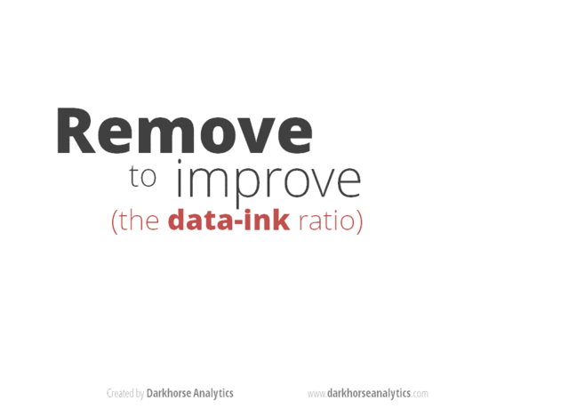
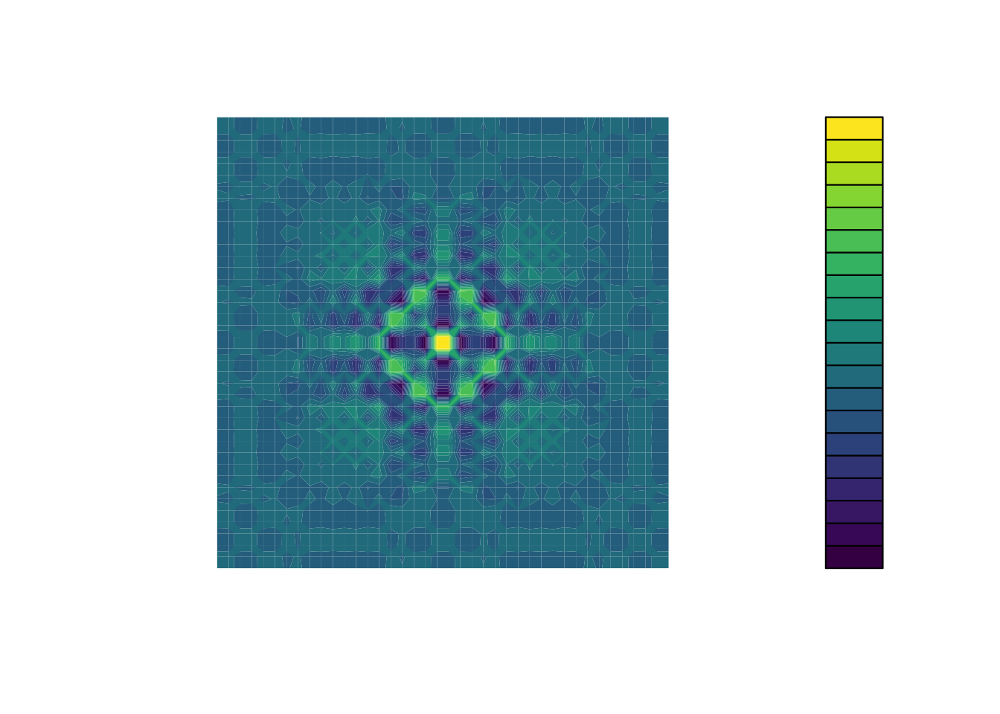

<div class = "blue">
### Learning Objectives

* Produce scatter plots, boxplots, and time series plots using ggplot.
* Describe what faceting is and apply faceting in ggplot.
* Set universal plot settings.
* Learn some basic visualization dos and don'ts
* Learn how to customize color in plots
* Gain a basic understanding of package `cowplot`
* Introduction to interactive `plotly` package
</div>
<br>

## Videos

- Data visualization Part 1a (coming soon)
- Data visualization Part 1b (coming soon)
- Data visualization Part 2a (coming soon)
- Data visualization Part 2b (coming soon)
- Data visualization Part 2c (coming soon)
- [Video Discussion](https://canvas.ucdavis.edu/courses/1019595/assignments/1510681)

## In Class Coding

[Submit Week 7 In Class Coding](https://canvas.ucdavis.edu/courses/1019595/assignments/1509412)

```{r setup, include=FALSE, echo=FALSE, results='hide'}
# List of all required packages across assignments
required_packages <- c(
  "ggplot2",       # Used throughout for plotting (part of tidyverse but sometimes loaded separately)
  "cowplot",       # Used throughout for plotting (part of tidyverse but sometimes loaded separately)
  "plotly",        # Used throughout for plotting (part of tidyverse but sometimes loaded separately)
  "tidyverse",     # Used throughout for data manipulation and plotting
  "viridis",       # For colorblind-friendly color palettes
  "RColorBrewer",  # For additional color palettes
  "sonify",        # For sound-based data visualization
  "seewave" ,
  "BrailleR"       # For sound wave visualization and analysis
)

# Check if required packages are installed, install if needed
new_packages <- required_packages[!(required_packages %in% installed.packages()[,"Package"])]
if(length(new_packages)) install.packages(new_packages, repos = "http://cran.us.r-project.org")

# Load all required packages
invisible(lapply(required_packages, library, character.only = TRUE))

library(tidyverse)
surveys_complete <- read_csv("https://ucd-rdavis.github.io/R-DAVIS/data/portal_data_joined.csv") %>% 
  filter(complete.cases(.))
```

<br>

# Part 1: Building Plots with ggplot2

We start by loading the required packages. **`ggplot2`** is included in the **`tidyverse`** package.

```{r load-package, message=FALSE, purl=FALSE}
library(tidyverse)
```

Remember the challenge from last week, where we merged in some extra variables to the survey data? This week we did it for you, since we're going to need those variables. We'll read in that merged datafile, but filter it to only get back rows where ALL the data are present, also known as "complete cases". We're also showing you a new little trick: using a period with a pipe. Normally, a pipe just sends the stuff on the left into the FIRST argument position in the function on the right. However, sometimes we want that stuff to get sent to a slightly different place in the righthand function. In this case, we want to send it into the `complete.cases()` function, so that function will run on the whole dataset. In order to specifically tell the pipe to send the lefthand side into this function, we put a period there. You can think of this as the target for the pipe.

```{r load-data, eval=FALSE, purl=FALSE}
surveys_complete <- read_csv("https://ucd-rdavis.github.io/R-DAVIS/data/portal_data_joined.csv") %>% 
  filter(complete.cases(.))
```

## Plotting with **`ggplot2`**

**`ggplot2`** is a plotting package that makes it simple to create complex plots
from data in a data frame. It provides a more programmatic interface for
specifying what variables to plot, how they are displayed, and general visual
properties. Therefore, we only need minimal changes if the underlying data change
or if we decide to change from a bar plot to a scatterplot. This helps in creating
publication quality plots with minimal amounts of adjustments and tweaking.

**`ggplot2`** functions like data in the 'long' format, i.e., a column for every dimension,
and a row for every observation. Well-structured data will save you lots of time
when making figures with **`ggplot2`**

ggplot graphics are built step by step by adding new elements. Adding layers in
this fashion allows for extensive flexibility and customization of plots.

To build a ggplot, we will use the following basic template that can be used for different types of plots:

```
ggplot(data = <DATA>, mapping = aes(<MAPPINGS>)) +  <GEOM_FUNCTION>()
```

- use the `ggplot()` function and bind the plot to a specific data frame using the
      `data` argument

```{r, eval=FALSE, purl=FALSE}
ggplot(data = surveys_complete)
```

- define a mapping (using the aesthetic (`aes`) function), by selecting the variables to be plotted and specifying how to present them in the graph, e.g. as x/y positions or characteristics such as size, shape, color, etc.

```{r, eval=FALSE, purl=FALSE}
ggplot(data = surveys_complete, mapping = aes(x = weight, y = hindfoot_length))
```

- add 'geoms' – graphical representations of the data in the plot (points,
  lines, bars). **`ggplot2`** offers many different geoms; we will use some 
  common ones today, including:
  
      * `geom_point()` for scatter plots, dot plots, etc.
      * `geom_boxplot()` for, well, boxplots!
      * `geom_line()` for trend lines, time series, etc.  

To add a geom to the plot use the `+` operator. Because we have two continuous variables,
let's use `geom_point()` first:

```{r first-ggplot, purl=FALSE}
ggplot(data = surveys_complete, mapping = aes(x = weight, y = hindfoot_length)) +
  geom_point()
```

The `+` in the **`ggplot2`** package is particularly useful because it allows you
to modify existing `ggplot` objects. This means you can easily set up plot
templates and conveniently explore different types of plots, so the above
plot can also be generated with code like this:

```{r, first-ggplot-with-plus, eval=FALSE, purl=FALSE}
# Assign plot to a variable
surveys_plot <- ggplot(data = surveys_complete, 
                       mapping = aes(x = weight, y = hindfoot_length))

# Draw the plot
surveys_plot + 
    geom_point()
```

**Notes**

- Anything you put in the `ggplot()` function can be seen by any geom layers
  that you add (i.e., these are universal plot settings). This includes the x- and
  y-axis mapping you set up in `aes()`.
- You can also specify mappings for a given geom independently of the
  mappings defined globally in the `ggplot()` function.
- The `+` sign used to add new layers must be placed at the end of the line containing
the *previous* layer. If, instead, the `+` sign is added at the beginning of the line
containing the new layer, **`ggplot2`** will not add the new layer and will return an 
error message.

```{r, ggplot-with-plus-position, eval=FALSE, purl=FALSE}
# This is the correct syntax for adding layers
surveys_plot +
  geom_point()

# This will not add the new layer and will return an error message
surveys_plot
  + geom_point()
```

## Building your plots iteratively

Building plots with **`ggplot2`** is typically an iterative process. We start by
defining the dataset we'll use, lay out the axes, and choose a geom:

```{r create-ggplot-object, purl=FALSE}
ggplot(data = surveys_complete, mapping = aes(x = weight, y = hindfoot_length)) +
    geom_point()
```

Then, we start modifying this plot to extract more information from it. For
instance, we can add transparency (`alpha`) to avoid overplotting:

```{r adding-transparency, purl=FALSE}
ggplot(data = surveys_complete, mapping = aes(x = weight, y = hindfoot_length)) +
    geom_point(alpha = 0.1)
```

We can also add colors for all the points:

```{r adding-colors, purl=FALSE}
ggplot(data = surveys_complete, mapping = aes(x = weight, y = hindfoot_length)) +
    geom_point(alpha = 0.1, color = "blue")
```

Or to color each species in the plot differently, you could use a vector as an input to the argument **color**. **`ggplot2`** will provide a different color corresponding to different values in the vector. Here is an example where we color with **`species_id`**:


```{r color-by-species, purl=FALSE}
ggplot(data = surveys_complete, mapping = aes(x = weight, y = hindfoot_length)) +
    geom_point(alpha = 0.1, aes(color = species_id))
```

We can also specify the colors directly inside the mapping provided in the `ggplot()` function. This will be seen by all geom layers and the mapping will be determined by the x- and y-axis set up in `aes()`.

```{r color-by-species2, purl=FALSE}
ggplot(data = surveys_complete, mapping = aes(x = weight, y = hindfoot_length, color = species_id)) +
    geom_point(alpha = 0.1)
```

Notice that we can change the geom layer and colors will be still determined by **`species_id`**


<div class = "blue">
### Challenge

Use `ggplot()` to create a scatter plot of `weight` and
`species_id` with weight on the Y-axis, and species_id on the X-axis. Have the colors be coded by `plot_type`. Is this a good way to show this type of data? What might be a better graph? 

<details>
<summary>ANSWER</summary>
```{r scatter-challenge, purl=FALSE}
ggplot(data = surveys_complete, mapping = aes(x = species_id, y = weight)) +
   geom_point(aes(color = plot_type))
```
</details>
</div>

<br>

## Boxplot

We can use boxplots to visualize the distribution of weight within each species:

```{r boxplot, purl=FALSE}
ggplot(data = surveys_complete, mapping = aes(x = species_id, y = weight)) +
    geom_boxplot()
```

By adding points to boxplot, we can have a better idea of the number of
measurements and of their distribution. 

Let's also use the geometry "jitter". `geom_jitter` is almost like `geom_point` but it allows you to visualize how the density of points because it adds a small amount of random variation to the location of each point. 

```{r boxplot-with-points, purl=FALSE}
ggplot(data = surveys_complete, mapping = aes(x = species_id, y = weight)) +
    geom_boxplot(alpha = 0) +
    geom_jitter(alpha = 0.3, color = "tomato") #notice our color needs to be in quotations 
```

Notice how the boxplot layer is behind the jitter layer? What do you need to
change in the code to put the boxplot in front of the points such that it's not
hidden?

<div class = "blue">
### Challenges

1. Boxplots are useful summaries, but hide the *shape* of the distribution. For
example, if the distribution is bimodal, we would not see it in a
boxplot. An alternative to the boxplot is the violin plot, where the shape 
(of the density of points) is drawn.

- Replace the box plot code from above with a violin plot; see `geom_violin()`.

2. In many types of data, it is important to consider the *scale* of the
observations.  For example, it may be worth changing the scale of the axis to
better distribute the observations in the space of the plot.  Changing the scale
of the axes is done similarly to adding/modifying other components (i.e., by
incrementally adding commands). Try making these modifications:

- Use the violin plot you made in Q1 and adjust the weight to be on the log~10~ scale; see `scale_y_log10()`.

3. Make a new plot to explore the distribution of `hindfoot_length` just for species NL and PF using `geom_boxplot()`. Overlay a jitter/scatter plot of the hindfoot lengths of the two species behind the boxplots. Then, add an `aes()` argument to color the datapoints (but not the boxplots) according to the plot from which the sample was taken.  

*Hint:* Check the class for `plot_id`. Consider changing the class of `plot_id` from integer to factor. Why does this change how R makes the graph?

<details>
<summary>ANSWER</summary>  
```{r}
#1 + 2

ggplot(data = surveys_complete, mapping = aes(x = species_id, y = weight)) +
    geom_jitter(alpha = 0.3, color = "tomato") +
    geom_violin(alpha = 0) + 
    scale_y_log10()

#3
surveys_complete %>% 
  filter(species_id == "NL" | species_id == "PF") %>% 
 ggplot(mapping = aes(x= species_id, y = hindfoot_length)) + 
  geom_jitter(alpha = 0.3, aes(color = as.factor(plot_id))) +
  geom_boxplot()


   
```
</details>
</div>
<br>

## Plotting time series data

Let's calculate number of counts per year for each species. First we need
to group the data and count records within each group. We can quickly use the dplyr function `count` to do this. `count` is very similar to the function `tally` we have seen before, but it interally calls `group_by` before the function and `ungroup` after. 

```{r, purl=FALSE}

yearly_counts <- surveys_complete %>%
                 count(year, species_id) 
```

Time series data can be visualized as a line plot with years on the x axis and counts
on the y axis:

```{r first-time-series, purl=FALSE}
ggplot(data = yearly_counts, mapping = aes(x = year, y = n)) +
     geom_line()
```

Unfortunately, this does not work because we plotted data for all the species
together. We need to tell ggplot to draw a line for each species by modifying
the aesthetic function to include `group = species_id`:

```{r time-series-by-species, purl=FALSE}
ggplot(data = yearly_counts, mapping = aes(x = year, y = n, group = species_id)) +
    geom_line()
```

We will be able to distinguish species in the plot if we add colors (using `color` also automatically groups the data):

```{r time-series-with-colors, purl=FALSE}
ggplot(data = yearly_counts, mapping = aes(x = year, y = n, color = species_id)) +
    geom_line()
```

## Faceting

**`ggplot2`** has a special technique called *faceting* that allows the user to split one
plot into multiple plots based on a factor included in the dataset. We will use it to
make a time series plot for each species:

```{r first-facet, purl=FALSE}
ggplot(data = yearly_counts, mapping = aes(x = year, y = n)) +
    geom_line() +
    facet_wrap(~ species_id)
```


<div class = "blue">
### Challenge

You are looking at a new dataset shared with you by a collaborator. You received the dataset shortly after the vernal equinox. Your collaborator didn't really give you any context on what the data represent, and you need to do some preliminary visualizations before you can really even formulate a question for them. Import the mystery dataset using:

```{r}
mystery <- read_csv("https://ucd-rdavis.github.io/R-DAVIS/data/mysteryData.csv")
```

Can you figure out what this dataset represents? 

*Hint* Use your new knowledge of faceting to break up the data into groups, and consider changing the size and transparency of your `geom_`'s to get a better look!

<details>
<summary>ANSWER</summary>
```{r}
# Preview the data
mystery %>%
  head(5)
# Plot the data
ggplot(data = mystery, mapping = aes(x = x, y = y)) +
     facet_wrap(~ Group) +
     geom_point(size = 0.1, alpha = 0.01) 
```

If all went well, and you faceted by group, set points to be very small, and transparency to be very high (i.e., a low `alpha` setting), you should discover that each group is the outline of a different animal! You may notice that there is some distortion going on, and our foxy friend in Group B appears to have some thick thighs. Try equalizing the coordinate space in the x- and y-axes by adding a `coord_equal()` to your `ggplot()` call:

```{r}
## Equalize coordinate mapping
ggplot(data = mystery, mapping = aes(x = x, y = y)) +
  facet_wrap(~ Group) +
  geom_point(size = 0.1, alpha = 0.01) +
  coord_equal()
```

This challenge was inspired by Trevor Branch's [Coelocanth post on Twitter](https://twitter.com/TrevorABranch/status/1227493205337182209) and adapted by [Christian John](https://jepsonnomad.github.io/).

</details>
</div>
<br>

## **`ggplot2`** themes

ggplot Themes are a great, easy addition that can make all your plots more readable (and a lot more pretty!)

In addition to `theme_bw()`, which changes the plot background to white, **`ggplot2`**
comes with several other themes which can be useful to quickly change the look
of your visualization. The complete list of themes is available
at <http://docs.ggplot2.org/current/ggtheme.html>. `theme_minimal()` and
`theme_light()` are popular, and `theme_void()` can be useful as a starting
point to create a new hand-crafted theme.


Usually plots with white background look more readable when printed.  We can set
the background to white using the function `theme_bw()`. Additionally, you can remove
the grid:

```{r facet-by-species-and-sex-white-bg, purl=FALSE}
 ggplot(data = yearly_counts, mapping = aes(x = year, y = n)) +
     geom_line() +
     facet_wrap(~ species_id) +
     theme_bw() +
     theme(panel.grid = element_blank())
```

<div class = "blue">
### Challenge 1 

Let's make one final change to our facet wrapped plot of our yearly count data. What if we wanted to split the counts of species up by sex where the lines for each sex are different colors? Make sure you have a nice theme on your graph too! 

*Hint* Make a new dataframe using the `count` function we learned earlier! 

<details>
<summary>ANSWER</summary>
```{r}
#new data frame counting the number of each sex of each species 
 yearly_sex_counts <- surveys_complete %>%
                      count(year, species_id, sex)

#plot code 
 ggplot(data = yearly_sex_counts, mapping = aes(x = year, y = n, color = sex)) +
     geom_line() +
     facet_wrap(~ species_id) +
     theme_bw()
```
</details>
</div>

<br>

<div class = "blue">
### Challenge 2

Use what you just learned to create a plot that depicts how the average weight
of each species changes through the years.

<details>
<summary>ANSWER</summary>
```{r average-weight-time-series, purl=FALSE}

#create a new dataframe 
yearly_weight <- surveys_complete %>%
                 group_by(year, species_id) %>%
                 summarize(avg_weight = mean(weight))


ggplot(data = yearly_weight, mapping = aes(x=year, y=avg_weight)) +
  geom_line() +
  facet_wrap(~ species_id) +
  theme_bw()
```
</details>
</div>

<br>

# Part 2: Data Visualization Best Practices

## Data Visualization in R

There are many tips and tricks that are available for the multitude of visualization packages in R. However, there aren't as many simple rules or suggestions on what actually makes a good visualization. This starts with the "grammar of graphics", which is the fundamental rules or principals which describe an art or science (from Wickham 2010).

 > "A good grammar will allow us to gain insight into the composition of complicated graphics, and reveal unexpected connections between seemingly different graphics (Cox 1978)"
 
Because there are so many options and methods to plot our data in R, we need to think about how we are going to represent the data, how can that data be interpreted visually, and what story it may tell.

A very nice example of this is provided by this animation (created by Darkhorse Analytics, and used in Jenny Bryan's excellent [stat545](http://stat545.com/block015_graph-dos-donts.html) course). It shows how *simplification* can make a big difference in communication. 



### Exploration vs. Communication

One thing to consider is what the objective is when creating a visualization or plot. When we build plots for exploratory purposes, we already know what the variables are we are using, and the objective is more about what sort of patterns the data might show. When communicating, the objective is more about providing a stand-alone snapshot which helps others *understand* what you are trying to convey. We'll cover more on this when we talk about `Rmarkdown`.

### `ggplot2`

While there are many visualization options in R, we believe the most comprehensive and powerful is the `ggplot2` package. Much of the class has used/follows `ggplot`, so here's a little background that might be useful.

 - Based on Grammar of Graphics book by Leland Wilkinson hence 'gg'
 - Each part of the plot is layered or built upon the other parts (like building legos).
 - Consider parts of a `ggplot2` as parts of a house.
    - Data = The materials the house is built from (`ggplot(data=yourdata)`)
    - Plot Type = The structure/design of your house (how will it look?) (`geom_`)
    - Aesthetics = What the exterior looks like, i.e., the paint/decor (`aes()`)
    - Stats = Ways to wire or plumb your house...how to tie your data together, or transform it (`stat_`)
    
A questions we often get asked when helping students with ggplot figures is, *how can I put two y-axis on my graph?* Short answer, with ggplot, you can't. There is a good reason for this though, which is basically that the creators of ggplot2 believe that duel y-axis are confusing, eaisly misunderstood and not invertible (given a point on the plot space, you can not uniquely map it back to a point in the data space). We agree with this logic, and would urge you to never put two differnt y-axis on the same plot. Instead, make two seperate graphs.    

## Color

There are so many options in R. It is fun to play around with color, but keep in mind not everyone sees color in the same way, and some folks cannot see certain spectrums of color (i.e., [absence of blue or green receptors is common](https://www.colormatters.com/color-and-vision/what-is-color-blindness)). See below for a example of what colorblindness may do...if you see numbers inside these circles, great, you have some blue/green retinal receptors.

 

Having said that, [here's a great cheat sheet of colors in R](https://www.nceas.ucsb.edu/~frazier/RSpatialGuides/colorPaletteCheatsheet.pdf), it can be handy when trying to find the correct color or name of a color. Check out this recent Nature perspective piece on [The misuse of colour in science communication](https://www.nature.com/articles/s41467-020-19160-7?utm_source=twitter&utm_medium=social&utm_content=organic&utm_campaign=NGMT_USG_JC01_GL_NRJournals).

### Discrete/Categorical:

For a very nice discussion about color palettes, I recommend [this page](http://www.cookbook-r.com/Graphs/Colors_(ggplot2)/) from the R cookbook folks. 

Additionally, check out the great [ggthemes](https://cran.r-project.org/web/packages/ggthemes/vignettes/ggthemes.html) package, which has many options. One I find very helpful is using `scale_color_colorblind()`, which if you have 8-9 categories, may be a nice way to display your data.

### Continuous: [`viridis`](https://cran.r-project.org/web/packages/viridis/vignettes/intro-to-viridis.html)

The `viridis` package is an excellent set of colors that better represent your data, are easier to read for those with colorblindness, and they also tend to print fairly well in grayscale.

Take a look at the [vignette online](https://cran.r-project.org/web/packages/viridis/vignettes/intro-to-viridis.html)!

An example:



### Customizing color pallettes in ggplot

The viridis color pallettes have been built into ggplot so that you can call upon them using the scale_fill_viridis_ or scale_color_viridis_ functions. Note that whether or not you use the fill or color scale function depends on which aesthetic you set in your plot. The functions also have extenstions depending on the kind of variable that you want to color: scale_fill_viridis_*d* is for discrete variables while scale_fill_viridis_*c* is for continous variables. Within the function, you can specify which virids pallette to use: A-D.

In this example we fill in our bars with the cut vairable in the diamond dataset, a categorical variable with 5 groups. 
```{r, echo=T, eval=T}
library(ggplot2)
ggplot(diamonds, aes(x = clarity, fill = cut)) + 
  geom_bar() +
  theme(axis.text.x = element_text(angle=70, vjust=0.5)) +
  scale_fill_viridis_d(option = "C") +
  theme_classic()
```

## Visualization Tips {.tabset .tabset-fade}

This information isn't meant to be comprehensive, but at minimum, it may provide some guidance when you are creating plots and figures. 

### Visualization Do's

The most basic tip is keep it simple! Stick with a clean and clear message, what is your plot/figure trying to get across? Data visualization is effective when it is simple, and repackages data into a visual story that is easy to understand. 

 - Label appropriately and legibly, including axes, and use text to highlight important bits
 - Use one color to represent each category, consider colorblind/BW friendly palettes
 - Order datasets using logical heirarchy (Make it easy for reader to compare values)
 - Use icons when possible to reduce unnecessary labeling
 - Pay attention to scale (e.g., start axis at zero not 2.4 to 3.5)
 - Include your data/outliers where possible


### Visualization Don'ts

A few things to avoid (which basically relates to keeping it simple):

 - Don't try to add too much into one plot...**keep it simple**
 - Don't add color uncessarily unless it provides a specific function
 - Avoid high contrast colors (red/green or blue/yellow)
 - Don't use 3D charts. They can make it hard to discern or perceive the actual information.
 - Avoid ornamentation (shadowing, extra illustration, etc)
 - Avoid more than 6 categorical colors in a layout unless you looking at continuous data.
 - Keep fonts simple (avoid uncessary **bold** or *italicization*)
 - Don't try to compare too many categories or data types in one chart
 
### Examples

#### Scatterplots

One of the best simple plots for examining patterns in data, but very effective. Also used when adding model trend lines.

```{r scatterplots}

suppressPackageStartupMessages(library(ggplot2))
plot(x=iris$Petal.Width) # single variable
plot(x=iris$Petal.Width, y=iris$Petal.Length) # multiple variables
ggplot() + geom_point(data=iris, aes(x=Petal.Width, y=Petal.Length))
ggplot() + geom_point(data=iris, aes(x=Petal.Width, y=Petal.Length, fill=Species), pch=21, size=3, alpha=0.5)

```


#### Lineplots

Comparing relative change in quantities across a variable like time. Note the change when we avoid facetting each line independently.

```{r lineplots}
plot(EuStockMarkets)

suppressPackageStartupMessages(library(tidyverse))
EuStockMarkets_df <- data.frame(as.matrix(EuStockMarkets), date=as.numeric(time(EuStockMarkets)))
EuStockMarkets_long <- gather(data = EuStockMarkets_df, key = "Market", value="value", 1:4)
ggplot() + geom_line(data=EuStockMarkets_long, aes(x=date, y=value, color=Market))

```

#### Barplots

Comparing totals across multiple groups. Notice legibility when you stack the bars.

```{r barplots}

# code adpated from https://www.analyticsvidhya.com/blog/2015/07/guide-data-visualization-r/
suppressPackageStartupMessages(library(viridis))
barplot(iris$Petal.Length)
barplot(iris$Sepal.Length,col  = viridis(3, option = "A")) 
barplot(table(iris$Species,iris$Sepal.Length),col  = viridis(3, option = "A")) 
```

<br>

## Saving Figures and Plots 

A plot you created with ggplot or another plotting package can be saved as .JPEGS (or .tiff, .img, etc) onto you. For any ggplot objects, we recommend using `ggsave`. 

First, let's create a new folder in this project called `figures`. Let's save all the figures we create to that folder. `ggsave` will default to saving the last plot you created, however, we think it is always a good idea to specify exactly which plot you want saved. To do that, we have to save our plot as an object. 

```{r, eval = F}
ggsave("figures/gridplot.png", fixed_gridplot)
```
#### With `ggsave` you can save images as

 - .png, .jpeg, .tiff, .pdf, .bmp, or .svg

#### Other arguments of `ggsave`

 - `scale` can scale the image (multiplicative scaling factor)
 - `width` and `height` let you specify the size of the image in `units` that you specify
 - `dpi` can change the quality of the image; for publication graphs we suggest over 700 dpi

```{r, eval = F}
ggsave("figures/gridplot.png", fixed_gridplot, width = 6, height = 4, units = "in", dpi = 700)
```

<br>

## Non-visual data interaction  


Discussions of visualization so far have taken for granted that visualization is accessible to everyone, but researchers and audiences alike are not all sighted. RStudio is behind on blind accessibility, but some packages can provide text descriptions and sonification/audification of plots to improve accessibility for non-visual data interaction.  

The `BrailleR` package ([read more here](https://r-resources.massey.ac.nz/BrailleRInAction/)), has a `VI()` function that wraps around plots and provides a text-description output. We can use the VI wrapper to interact with our plots from a textual perspective and identify what information is missing. Such text can also be used as alt-text when publishing this material. What could we do to our plot to improve the text description?

```{r, echo=T, eval=T, warning= F, message = F}
#install.packages("BrailleR")
library(BrailleR)

barplot <- ggplot(diamonds, aes(x = clarity, fill = cut)) + 
  geom_bar() +
  theme(axis.text.x = element_text(angle=70, vjust=0.5)) +
  scale_fill_viridis_d(option = "C") +
  theme_classic()

VI(barplot)
```

The `sonification` package's `sonify` function can be used to represent data in audio form, where the x-axis can span sound across time, so that the length of time a sound plays follows the data long the x-axis from left to right; the y-axis can be expressed as pitch, so that the pitch of the sound matches to the values of the data (lower value = lower pitch).

```{r, echo = F, eval = T, warning= F, message = F}
library(sonify)
library(seewave)
sonif <- sonify(iris$Petal.Width)
savewav(sonif, file = "sw.width.sound.wav")
```

One variable can be used as an input to hear the distribution. For instance this univariate plot of iris petal width visually looks like this:
```{r, echo=T, eval=T, warning= F, message = F}
plot(iris$Petal.Width)
```

Using `sonify` instead of plot, the distribution of iris petal width sounds like this:
```{r, echo = T, eval = T, warning= F, message = F}
#install.packages("sonify")
library(sonify)
sonify(iris$Petal.Width)
```
If you try this on your computer it should play autmatically, buy on the website you can listen below: 

<audio controls>
  <source src="sw.width.sound.wav" type="audio/wav">
</audio>

```{r, echo = F, eval = T, warning= F, message = F}
sonif <- sonify(x = iris$Petal.Width, y = iris$Petal.Length)
savewav(sonif, file = "sw.width.length.sound.wav")
```
Two variables can be used as input to hear the relationship between continuous variables. For instance this bivariate plot of iris petal length and petal width visually looks like this:
```{r, echo=T, eval=T, warning= F, message = F}
plot(x = iris$Petal.Width, y = iris$Petal.Length)
```

And using `sonify`, sounds like this:
```{r, echo=T, eval=T, warning= F, message = F}
sonify(x=iris$Petal.Width, y = iris$Petal.Length) 
```

<audio controls>
  <source src="sw.width.length.sound.wav" type="audio/wav">
</audio>

# BONUS CONTENT #

This is provided for your reference, but won't be something we cover in class or address on the exam.

## Publishing Plots: `cowplot`

A few excellent options exist for creating multi-paneled plots for publications. The first and foremost is a package by Claus Wilke called [`cowplot`](https://cran.r-project.org/web/packages/cowplot/vignettes/introduction.html). With `cowplot`, it's possible to quickly combine existing `ggplots`, creating publication quality plots. See the vignette for more options, but here's a quick example from the vignette below:

```{r, echo F, warning = F, message = F}
detach("package:BrailleR", unload=TRUE)
```


```{r cowplot, echo=T, eval=T}
library(cowplot)

# make a few plots:
plot.diamonds <- ggplot(diamonds, aes(clarity, fill = cut)) + 
  geom_bar() +
  theme(axis.text.x = element_text(angle=70, vjust=0.5))
#plot.diamonds

plot.cars <- ggplot(mpg, aes(x = cty, y = hwy, colour = factor(cyl))) + 
   geom_point(size = 2.5)
#plot.cars

plot.iris <- ggplot(data=iris, aes(x=Sepal.Length, y=Petal.Length, fill=Species)) +
  geom_point(size=3, alpha=0.7, shape=21)
#plot.iris

# use plot_grid
panel_plot <- plot_grid(plot.cars, plot.iris, plot.diamonds, labels=c("A", "B", "C"), ncol=2, nrow = 2)

panel_plot

# fix the sizes draw_plot
fixed_gridplot <- ggdraw() + draw_plot(plot.iris, x = 0, y = 0, width = 1, height = 0.5) +
           draw_plot(plot.cars, x=0, y=.5, width=0.5, height = 0.5) +
           draw_plot(plot.diamonds, x=0.5, y=0.5, width=0.5, height = 0.5) + 
  draw_plot_label(label = c("A","B","C"), x = c(0, 0.5, 0), y = c(1, 1, 0.5))

fixed_gridplot
```

## The package `plotly`

The package `plotly` is an excellent, easy to use resource that allows you to quickly create interactive, web-based figures. We have used plotly to illustrate patterns in data to collaborators, to visualize patterns in our data during the pre-analysis stage, and even impress with "fancy" graphics during a conference talk! 

Let's try plotly together using some of the `iris` data: 

```{r, warning = F, message =F}
library(plotly)

plot.iris <- ggplot(data=iris, aes(x=Sepal.Length, y=Petal.Length, fill=Species)) +
  geom_point(size=3, alpha=0.7, shape=21)

plotly::ggplotly(plot.iris) #it's as simple as that! 
```

This lesson was contributed by [Martha Zillig](https://github.com/MarthaWohlfeil).

This lesson is adapted from the Software Carpentry: R for Reproducible 
Scientific Analysis [Vectors and Data Frames materials](http://data-lessons.github.io/gapminder-R/03-data-types-subsetting.html)
and the Data Carpentry: R for Data Analysis and Visualization of Ecological Data 
[Exporting Data materials](http://www.datacarpentry.org/R-ecology-lesson/03-dplyr.html).