Once we've setup R/RStudio, and installed git, the next step is seeing whether we can connect RStudio with Git. Please try this at home before class, and then we'll go through it when we meet.

 

::: blue
**This lesson assumes you have:**

-   registered for your free Github account
-   installed **R**, **RStudio**, and **git**
-   Filled out our google form and accepted your invitation to the repository in our [`UCD-R-DAVIS` group](https://github.com/ucd-r-davis)
:::

  This lesson is to demonstrate the basics of using git with RStudio, and should provide a basic understanding of why we want to use version control where possible.

 

## Introduction to Version Control

At some point many of us have probably had files in a directory that may have looked like this ([*from PHDcomics*](http://phdcomics.com/comics/archive.php?comicid=1323)):

Version control gives you a better way to track changes for things like data files and code, and in a more manageable way. That’s important because when the reviews come back on your paper and ask you to perform some additional analyses and you open up this directory, it can be pretty difficult to figure out which file you should actually use. At the very least you’ll spend a bunch of extra time figuring it out before you get to work, or at worst you may pick the wrong file and then have to redo all your work after realizing the results weren't the same as in the submitted version of the manuscript. For much more detail on setting git with R (or troubleshooting), see the [happygitwithr.com](http://happygitwithr.com/) website.

 

### Benefits of Version Control

-   *Track changes on steroids*
    -   Tracks every change ever made in groups called commits
    -   Every commit stores the full state of all of your files at that time
    -   Never lose anything
    -   Easily unbreak your code/data/manuscript
    -   No more file name changes
-   *Collaboration*
    -   Work on things simultaneously
    -   See what changes others have made
    -   Everyone has the most recent version of everything

 

## *First Timers*: Connecting RStudio & Github

Setting up Git involves some tricky stuff with SSH keys, which are GitHub's way of making sure no one besides you messes with your account and your code. They can be tricky to set up, but we're here to help! Try going through this walkthrough before class so we can spend more of class homing in on folks' specific issues. (Note: this walkthrough is for a Mac but it should be pretty much the same for a PC user. if you're a PC user and this walkthrough isn't working, pause and we'll figure it out in class) It's ok if you get stuck!

 

### 1) Creating a SSH Key

a)  Open RStudio. From the RStudio toolbar at the top, open Tools \> Global Options

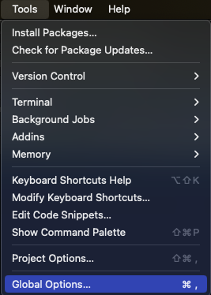

b)  Click on Git/SVN. If the box that says "Enable version control interface for RStudio projects" is not checked, check the box. Then, click "Browse" next to "Git executable" and enter the filepath to your git (which you already should have installed, in step 5!) To find your git filepath, go to your Terminal and type which git then hit enter.

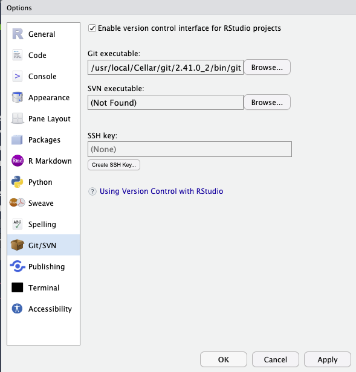

c)  Click on "Create SSH Key"

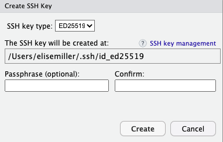

d)  Click Create, without changing the defaults. You can leave Passphrase blank.

e)  Highlight and copy the filepath listed under "The SSH key will be created at:" using Ctrl C or Command C

f)  Next click "view public key" and copy all of the text in the pop-up window using using Ctrl C or Command C to get the public key contents in your clipboard.

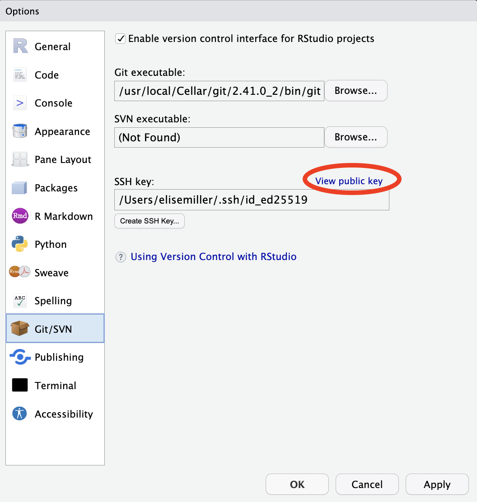

 

### 2) Adding SSH key to Github

a)  Go to your Github Account \> profile photo \> Settings as shown below

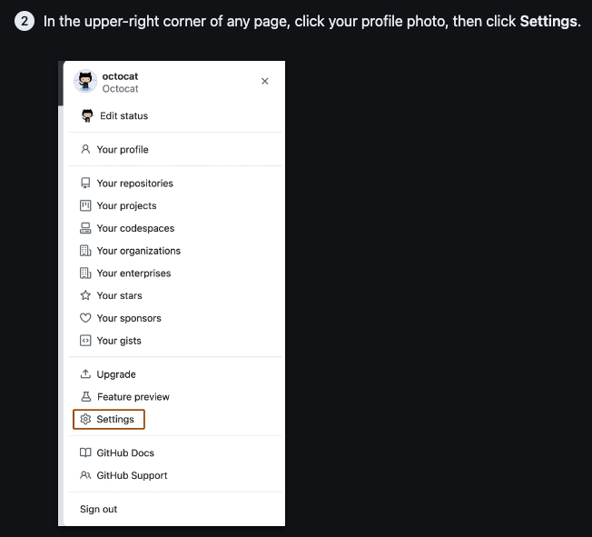

b)  Follow these steps: (your public key is now in your clipboard, so when you get to "paste your public key" you can just hit Ctrl V or Command V.

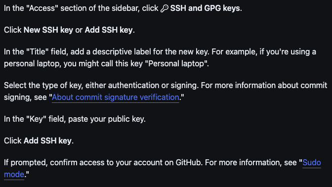

c)  Assuming you've created your own repository already, go to <https://github.com/orgs/UCD-R-DAVIS/repositories> and click on the one with your username on the end. (If you haven't made a repository yet, make sure you've filled out the survey <https://forms.gle/YahVutQ6Ds1CpHFP6> and followed the instructions)

 

### 3) Saving a Github repository to your local computer

a) The next step is to clone your repository. To start this process, click the Green "Code" button then click the "SSH" tab. Copy the link using the Screenshot 2023-09-28 at 10.30.16 AM.png icon

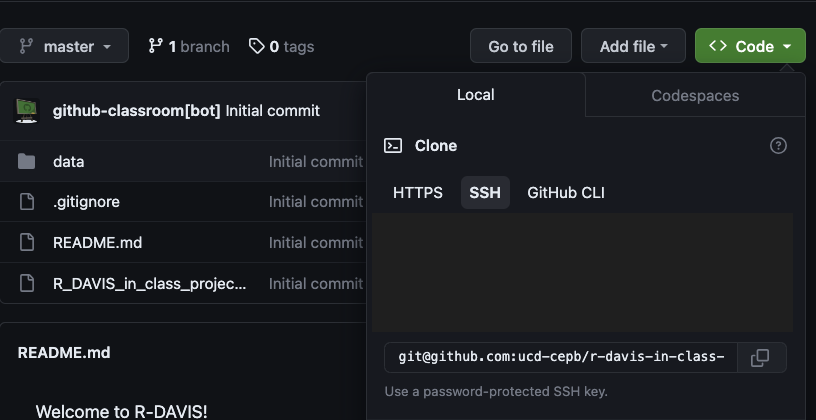

b) Now we're ready to make a local version of our repository on our desktop. Open RStudio and click on New Project.

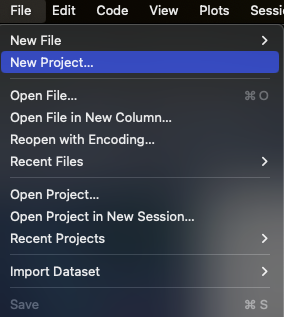

c) Click on "Version Control".

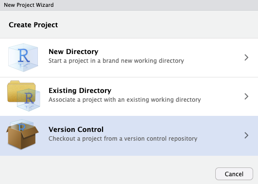

d) Click on "Git"

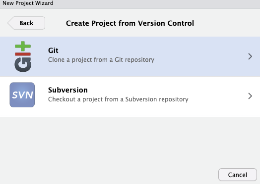

e) Paste the link from your clipboard (using Ctrl V or Command V) where it says "Repository URL". The "Project directory name" is what you want your R-DAVIS folder to be called. If you hit Tab, the Project directory name will automatically create a name for you. This is generally preferred so you can keep track of things more easily. Lastly, decide where you want your R projects to live on your computer, and navigate there using "Browse". We suggest creating a "R-Projects" folder on either your desktop or your **local** documents folder. For example, Tara created a "R-Projects" folder in her local Documents folder and named her R-DAVIS folder after her directory name: **Documents/R-Projects/R_DAVIS_in_class_project_tarapozzi**. (Note the dash and underscores -- it's a good idea to not have any spaces in your filenames or filepaths) For the rest of this class, everything we do will be in this folder. As a forewarning, sometimes people have had trouble using MyCloud or other cloud-based storage for their R folders, so that is why we recommend storing locally on your desktop or in your documents folder.

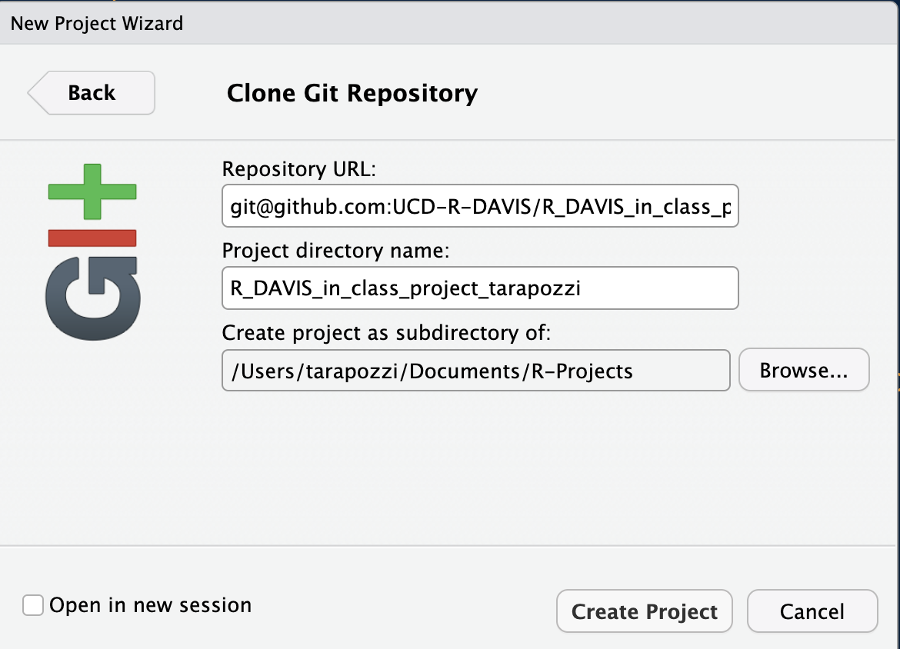

f) Click "Create Project" -- and you're done!

Now you have your very own corner of the internet where all of your work for this class will live.

 

## *Nth timers*: Already have an SSH key set up? Connecting a Github respository and RStudio is a little more straightforward!

For our purposes the "*best practice*" (i.e., **easier**) for setting up a new github repository in RStudio is through an RStudio *Project*. First, ideally what we want to do is create a new repository on [Github](https://github.com/), then create a new RStudio Project to **clone** (copy) our repository onto our computer (a local version). See the steps below.

 

### 1) Create a new repository on Github

-   Typically, the preferred method is to create a new repository on Github...**HOWEVER**:
-   For this class we've already created a repository for you, and you will get a Github Classroom link via email. When you click the link, Github creates a new repository for you, which our class will be able to view and work with.
-   When you use the Github Classroom link, a repository will be created that looks like "ucd-r-davis/r-davis-in-class-project-YourGithubUsername"

 

### 2) Clone your repository to your computer

You should now have a repository on Github. Our class is all housed in the [UCD-R-DAVIS](https://github.com/ucd-r-davis) Organization, so your repository should appear there, and it should look something like this:

-   [`https://github.com/UCD-R-DAVIS/R_DAVIS_in_class_project_YourGithubUsername`](https://github.com/UCD-R-DAVIS/R_DAVIS_in_class_project_tara-pozzi).
-   **To *`clone`* your repository** (i.e. copy to your computer):
    -   We're going to stick with using **`SSH`:** link for now. If you successfully used HTTPS, congrats -- you can leave it that way. But if you're on the SSH train, look for the big green "*Code*" button. Make sure you select the "**Use SSH**" link
    -   Copy that link (should be something like *`git@github.com:UCD-R-DAVIS/R_DAVIS_in_class_project_YourGithubUsername.git`*).

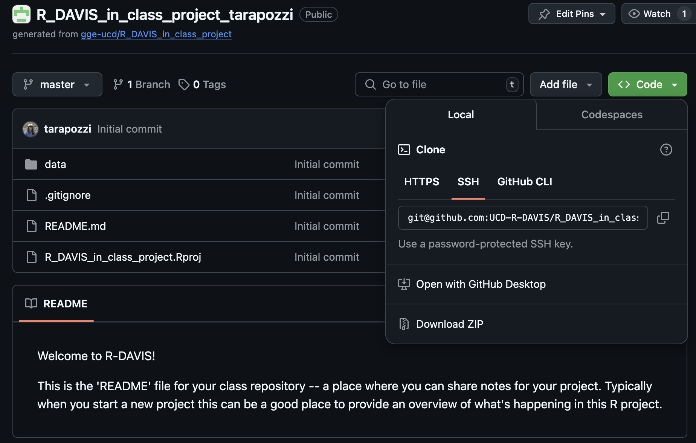

 

### 3) Create a New Version Controlled (`git`) RStudio Project

Now we'll create an RStudio Project and link our Github repository (following [*Section 13.3* of `happygitwithR`](http://happygitwithr.com/rstudio-git-github.html#clone-the-new-github-repository-to-your-computer-via-rstudio)).

-   In RStudio, start a new Project: `File > New Project > Version Control > Git`.

-   In the “**Repository URL**” paste the URL of your new GitHub repository. If you hit **`Tab`**, the *Project directory name* will automatically populate with the exact name of the repository. This is generally preferred so you can keep track of things more easily. You should put this project into a subdirectory. We suggest creating a "R-Projects" folder on either your desktop or your **local** documents folder. For this class, I've created a **Documents/R-Projects/R_DAVIS_in_class_project_tarapozzi**. (Note the dash and underscores -- it's a good idea to not have any spaces in your filenames or filepaths) For the rest of this class, everything we do will be in this folder.

 

For the rest of your life now, you can put GitHub repositories in this "R-Projects folder". It's really useful to keep all your work well organized!

Another critical thing with git and GitHub is that you should **never** nest projects inside of projects. Treat each RProject/git repository as a completely separate entity, containing only the stuff pertaining to that project. If you try to put a folder that's an RProject inside another folder that's an RProject, stuff is gonna go wrong. Just keep them all separate, but ideally contained in some other folder, like "R_Projects", which is NOT a GitHub repository or RProject, just a boring regular folder.

-   This new subdirectory that you specified will be all these things:
    -   a directory on your computer
    -   a local Git repository, linked to a remote GitHub repository
    -   an RStudio Project
    -   it should contain a `README.md` file with some content that we've created...we'll edit that next.
    -   it should have a data folder with some data we'll use soon

<!-- STOP and check in here...have folks gotten this part? Are there questions? Ask some paired/group questions?-->

 

## Push & Commit Changes to your `README.md`

We'll go over this part in class. If you successfully created your RStudio project, you've done most of the hard work...what remains is:

-   Test whether we can make changes or **edit** our README on our local `master` branch (copy of the repository on your computer).
-   **`commit`** these changes (make a version control record of your change/s)
-   **`push`** these change back to the `remote` which is the copy of the repository on Github.com.

 

#### Edit README

In RStudio, open your new project (`R_DAVIS_in_class_project_YourGithubUsername`). Navigate to the *Files* tab and open the `README.md` file. You can click on it in the window and it will automatically open up.

-   **Edit your README by adding in the following:**
    -   Name
    -   Preferred pronouns
    -   General research area/interest
    -   Delete all the original text in the README, leaving just the information about you

 

#### Stage & Commit to Git

-   Click on the **Git** tab. When you click on the git tab, you should see the `README.md`, and a `.Rproj` file, and perhaps a few other files. That's ok!

-   Click on the small box to the left of the `README.md` to stage the file. Then click the `commit` button. You'll see a new widow, on the upper right you need to type a `commit` message, something simple, short, and descriptive. Then click the `commit` button. You should see a little box with message committed.

-   Finally before you close everything, hit the **PUSH** button. This *pushes* the changes to the github repository (you may need to enter your Github username & password once depending on whether you used `https` or `ssh`).

-   If you go back to the repository in your browser and refresh the page, you should see the changes you've made. Equally important, any collaborator or instructor can now `pull` those exact changes into a copy of the repo on our computer.

Hopefully that all worked! You can now push and pull from your repository.

  Parts of these instructions were adapted from those written by Ethan White for his [Data Carpentry for Biologists](http://www.datacarpentry.org/semester-biology/) course, and from Jenny Bryan's [happygitwithr.com](http://happygitwithr.com/) website.
