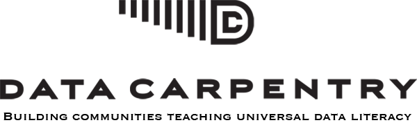

## (**R**-**D**ata **A**nalysis & **V**isualization **I**n **S**cience) {-}

 

### Course Description

This course will provide an introduction to data/project management, manipulation, visualization and analysis, across a broad set of scientific data (spatial, genomic, field, etc). Class will typically consist of short introductions or question & answer sessions, followed by hands on computing exercises. The course will be taught using [R](https://cran.r-project.org/)/[RStudio](https://posit.co/products/open-source/rstudio) and [Quarto](https://quarto.org/), but the concepts learned will easily apply to all programming languages and database management systems. **No background in databases or R/computational experience is required.**

### Prerequisite Knowledge and Skills

- Willingness to practice coding
- Willingness to try things
- Willingness to fail
- Willingness to put in the time

### Purpose of Course

In this course you will learn fundamental aspects of computer programming that are necessary for conducting ecological research. By the end of the course you will be able to use these tools to import data into R, wrangle various types of data, summarize and analyze data, create visualizations, write reports/manuscripts/CV's in RMarkdown, save and export data/figures, as well as collaborate on Github with version-controlled projects.

The focus of this course is to provide graduate students with training that develops and teaches the tools applicable to the entire process of **reproducible data-driven research** and encourage the use of open-source tools. By learning how to get the computer to do your work for you, you will be able to do more science faster, and your future-self will thank you.

### Course Objectives

Students completing this course should be able to:

 - Organize R projects in GitHub
 - Read, import/export data
 - Tidy/summarize and analyze data
 - Create publication-quality graphs and figures
 - Write simple functions/programs in R
 - Search for and access new learning materials to further develop their computational skills
 - Apply these tools to address scientific research questions

### Course Format  

To get the most out of in-class time together, R-DAVIS will combine video material that you watch outside of class with in-person discussion and hands-on activities that we do together in class. Unless unforeseen circumstances arise, videos will be posted by Monday evening to the relevant week on the Lectures page. Please come to class having watched the material relevant to that week's lesson, completed the video quiz, and perhaps having taken a cursory attempt at trying out what is covered in the videos. We are organizing the course this way to give you more opportunities to interact with course content--and to do so in different ways.

### Grading and Class Expectations 

R-DAVIS is a graded, 3-unit course. The [university's formula](https://registrar.ucdavis.edu/faculty-staff/faculty/courses#:~:text=Academic%20Credit%2C%20Units%2C%20&%20Workload,Committee%20on%20Courses%20of%20Instruction.&text=The%20value%20of%20a%20course,a%20student%2C%20or%20the%20equivalent) for a 3-unit course is that you should expect to spend ~9 hours a week in total on the course. You might spend less time then that, or some weeks you might spend more. Regardless, if you only put in work during the scheduled class time, you are unlikely to meet learning goals for the course.

R-DAVIS only has 10 class sessions (and 10 labs), so missing class means that you are missing a sizable chunk of the course. We expect you to attend class in person, and will not have a hybrid remote option (in our experience, it works really poorly in this instructional context). Because we know that things do come up from time to time, we give each student one dropped in-class and one dropped lab submission (i.e., you can miss one for any reason). I do not evaluate reasons for absences/non-submissions or classify them as excused or unexcused.

R-DAVIS grades are based on a combination of several tasks and deliverables. Grades are calculated at points_earned/total_available.

- A = 93-100% | A- = 90-92%
- B+ = 87-89 | B = 83-86 | B- = 80-82%
- C+ = 77-79 | C = 73-76 | C- = 70-72%
- D = 60-69%
- F = < 60%

### Assignments and Credit

Points are earned as follows:

- Watching lecture videos before class

Videos will be posted by Monday. By Thursday at 10am before class, you are expected to post a brief discussion about the questions and major points of uncertainty you have after the video that you want to resolve in class. 9 weeks, 3 points each (Due at 10am on Thursdays, i.e., 3 hours before class starts)

- Submitting weekly in-class scratch work. 

These submissions are credit/no-credit, with credit based on *effort* and NOT *completion*. I.e., this is your scratch sheet from class, whatever that looks like. 10 weeks, 10 points each. (Due at 3:10pm, i.e., 10 minutes after class ends)

- Submitting take-home labs. 

These submissions are credit/no-credit, with credit based on *effort* and NOT *completion*. Ideally, you'll be able to work through and complete the lab fully, but I believe you will learn far more from any effort--successful or unsuccessful--you put in than you will from copying and pasting from the key, having Claude solve it, etc. 10 take-home labs, 10 points each. (Due at 1:00pm, on Thursdays, i.e. by start of class, except Lab 10 which is due at the start of the final)

- Midterm Exam: In-class exam, 45 points

We will provide guidance about the format later in the course. Generally, the format will be similar to labs in that you will use R to read in and manipulate a dataset and generate statistical/visual results.

- Final Exam: In-class (during university-designated exam period), 45 points

We will provide guidance about the format later in the course. Generally, the format will be similar to labs in that you will use R to read in and manipulate a dataset and generate statistical/visual results.

We will not take attendance for Tuesday afternoon discussion sections, since not all students are typically there at the same time. But we strongly encourage you to attend. Our experience is that students who engage--with R, with us, with classmates--more times during the week have much better learning outcomes. 

### Pedagogy

We believe that instructors have a duty to examine their pedagogy--and students have a right to know the pedagogical assumptions that shape our course. This section describes the five key principles that motivate our course. It is also an invitation to dialogue on how these can be improved.^[Acknowledgement and thanks to Dr. David Carter at the University of Utah, from whom many of these principles have been learned and adopted.]

#### Equity is a vital social project

We are committed to diversity (social/demographic differences such as race, ethnicity, gender, sex, sexual orientation, ability, and language) and the pursuit of equity (the fair distribution of resources and opportunities, accounting for past and present events, conditions, and contexts) as a vital project in and outside of the classroom. We are also acutely aware that we will fall short of these ideals — as will our teaching. We invite you to hold us and this course to them, and to help us learn.

#### Inaccessibility is a choice

Inaccessibility is a choice (and choosing accessibility benefits all). Accessibility is both more necessary and easier than acknowledged. As the case of 
[curb cuts](https://uxdesign.cc/the-curb-cut-effect-universal-design-b4e3d7da73f5) famously demonstrates, anything that delivers greater accessibility tends to benefit everyone. While digital tools and contexts offer the promise of flexible inclusion in the form of customizable, one-size-fits-one experience, we realize, that many of the tools and practices we use in data science and statistical programming fall short of even modest accessibility goals. With apologies for the extra time and energy it demands, we ask you to let us know as soon as you encounter any part of this course that impedes your participation, so that we can prioritize its immediate correction.

#### Students are people

We recognize every student is a human being with relational, physical, spiritual, and psychological factors outside the classroom that can interfere with focus and deadlines. Those factors do not change the baseline course expectations we have for you as an instructional team. Still, we want to know if these life conditions are undermining your learning, both because we care about you as humans, and because there are often ways we can offer support and flexibility while still meeting course standards.

#### Failure is productive

Data science and programming are all about learning from failure--stuff like fixing bugs, troubleshooting messy data, and figuring out why your model blew up. You will learn the most by trying something, having it break, trying to decipher the error message, and iterating until you get it to work. We want to encourage you to take risks, fail repeatedly, and learn volumes in the process. In practice, this means that we would *much* rather have you only get half of a lab done, but really understand that half, instead of borrowing your friends' code that you don't really understand and completing the lab. To put our money where our mouth is: *in-class work and labs are graded on the basis of participation (please note that this does not say "completion"). We *will* pay attention to effort and evidence of learning. That means that we want to see your work, your scratch code, and how you got where you got *MUCH* more than we want to see a perfectly rendered AI code block that you made when you couldn't figure it all out and panicked about wanting a completed assignment. In fact, if it becomes clear to us that we are reviewing AI-only output, that work will not receive credit.

#### Busywork is bad

We want this course to be a "no busy work" space. On a micro-level, if you find an assignment unproductive, feel free to propose an alternate activity that achieves the same/similar aims. On a macro-level, if you find this training unproductive, feel free to propose an alternative curriculum that achieves the same/similar aims (e.g., doing labs in the Python programming language instead of R and duplicating the workflow and version control elements of the course).

 

### Territory Acknowledgement

Acknowledging territory shows recognition of and respect for Native Americans. We would like to respectfully acknowledge that the land on which we gather is traditional unceded Patwin territory. This territory acknowledgement is an adaptation of one written by the Canadian Association of University Teachers. For more information, please see their [website](https://www.caut.ca/content/guide-acknowledging-first-peoples-traditional-territory).

### Academic Integrity
As a University of California, Davis student, you have agreed to abide by the University's Code of Academic Conduct (<http://sja.ucdavis.edu/files/cac.pdf>).  All academic work must meet these standards. Lack of knowledge of the academic honesty policy is not a reasonable explanation for a violation. Questions related to course assignments and the academic honesty policy should be directed to the instructor.

 
### Special Accommodations
If you have a learning disability, sensory or physical disability or if English is not your first language and you need special assistance in lecture, reading assignments, or written assignments, please contact the instructor at the beginning of the quarter and contact the UCD Student Disability Center (SDC). The SDC office at the University of California, Davis is located at 54 Cowell Building, or the SDC can be reached by phone at (530) 752-3184. For more information, please see: https://sdc.ucdavis.edu/.

### Course Support

This course content integrates and builds on Data Carpentry Ecology lessons. Course support is provided by the UCD College of Agricultural and Environmental Sciences. The original version of this course at UCD was led by Liza Wood, Christian John, and Tara Pozzi (among others).

Data Carpentry develops and teaches workshops on the fundamental data skills needed to conduct research. Our mission is to provide researchers high-quality, domain-specific training covering the full lifecycle of data-driven research. Data Carpentry is now a lesson program within The Carpentries, having merged with Software Carpentry in January, 2018. Data Carpentry's focus is on the introductory computational skills needed for data management and analysis in all domains of research. Our lessons are domain-specific, and build on the existing knowledge of learners to enable them to quickly apply skills learned to their own research. Our initial target audience is learners who have little to no prior computational experience. We create a friendly environment for learning to empower researchers and enable data driven discovery.

See the Data Carpentry [website](http://www.datacarpentry.org/) for more information.